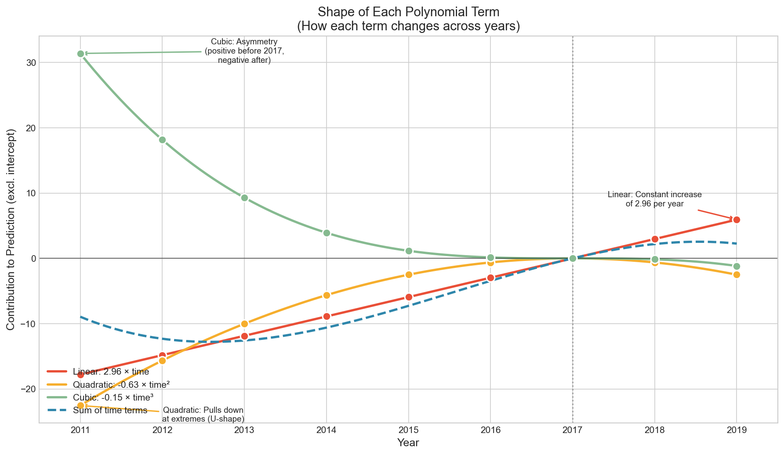
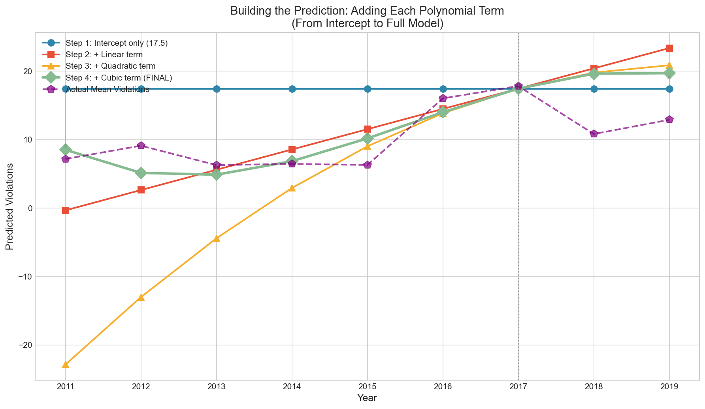
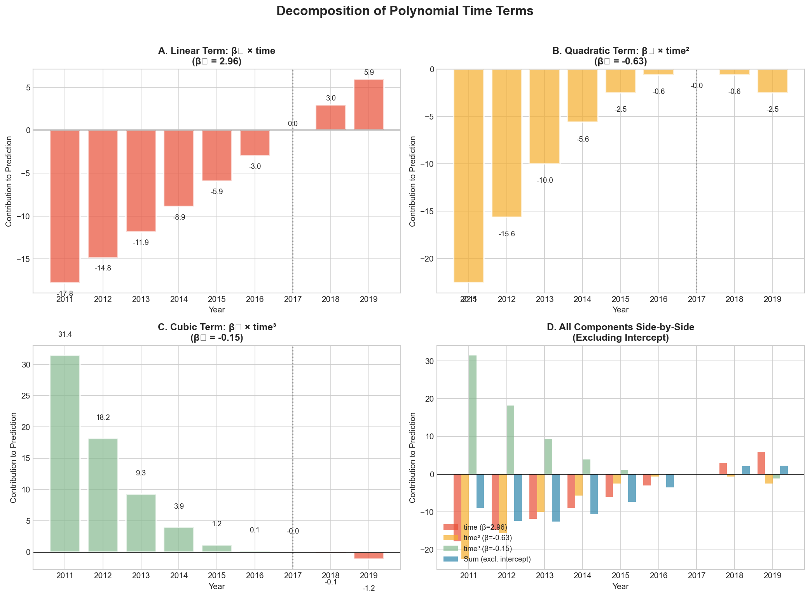
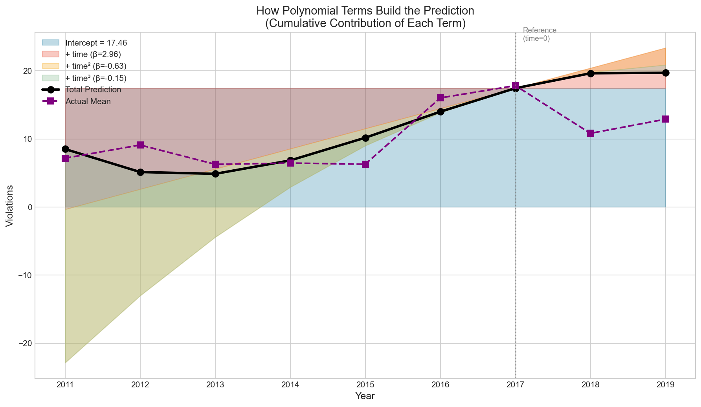

# Hierarchical Mixed-Effects Model for EPA/WPS Violations

## Overview

This analysis uses a **hierarchical (multilevel) mixed-effects model** to predict WPS violations across U.S. states from 2011 to 2019. The model accounts for the nested structure of the data where state-year observations are clustered within states.

> ### ⚠️ Note on sample and model version
>
> This document describes the model as currently implemented in
> `hierarchical_violations_model.py`. The script fits **two models on the
> spending-matched analytic sample**:
>
> - **Model 1** — time polynomial only (random intercept + random slope)
> - **Model 2** — Model 1 **+ inflation-adjusted agricultural spending**
>
> Because Model 2 requires a STAG spending record for each state-year, the
> analytic sample is restricted by listwise deletion to **N = 250
> observations across 47 states** (state-years lacking a spending record are
> dropped). To keep the Model 1 vs. Model 2 comparison valid, **Model 1 is
> re-estimated on the same 250-observation sample** (per the convention in
> `CLAUDE.md`). All numbers below are from this current N = 250 specification.
>
> An earlier version of this analysis fit a time-only model on the full
> N = 394 violations sample (every state-year with a non-missing violation
> count). That full-sample baseline produced different headline numbers
> (Intercept ≈ 16.21, ICC ≈ 0.624); it is no longer the model the script
> outputs and has been superseded by the spending-matched specification here.

---

## Table of Contents

1. [Data Description](#data-description)
2. [Model Specification](#model-specification)
3. [Time Variable Construction](#time-variable-construction)
4. [Understanding Polynomial Terms](#understanding-polynomial-terms-time-time²-time³)
5. [Model Results](#model-results)
6. [Interpreting Fixed Effects](#interpreting-fixed-effects)
7. [Interpreting Random Effects](#interpreting-random-effects)
8. [State-Specific Results](#state-specific-results)
9. [Model Comparison](#model-comparison)
10. [Visualizations](#visualizations)
11. [Key Findings](#key-findings)
12. [Files Generated](#files-generated)

---

## Data Description

| Attribute | Value |
|-----------|-------|
| **Data Sources** | EPA ECHO establishments data, STAG spending data |
| **Time Period** | 2011–2019 (9 years) |
| **Geographic Scope** | 50 U.S. states only (excludes territories, tribes, regions) |
| **Unit of Analysis** | State-year |
| **Analytic Sample** | 250 observations, 47 states (spending-matched; see note above) |
| **Outcome Variable** | `violations` (count of WPS violations) |

### Descriptive Statistics (N = 250 analytic sample)

| Statistic | Value |
|-----------|-------|
| Mean | 10.09 |
| Std Dev | 15.52 |
| Min | 0 |
| 25th Percentile | 2 |
| Median | 6 |
| 75th Percentile | 12.75 |
| Max | 172 |

### Violations by Year (N = 250 analytic sample)

| Year | Mean | Std Dev | Min | Max | N |
|------|------|---------|-----|-----|---|
| 2011 | 7.18 | 6.32 | 1 | 24 | 39 |
| 2012 | 9.12 | 7.58 | 1 | 30 | 34 |
| 2013 | 6.28 | 5.73 | 1 | 22 | 25 |
| 2014 | 6.46 | 5.78 | 1 | 22 | 24 |
| 2015 | 6.30 | 7.75 | 0 | 26 | 30 |
| 2016 | 16.03 | 32.51 | 1 | 172 | 29 |
| **2017** | **17.84** | 20.89 | 1 | 84 | 25 |
| 2018 | 10.83 | 15.58 | 1 | 63 | 23 |
| 2019 | 12.90 | 13.59 | 2 | 53 | 21 |

**Key observation**: Violations rise into a 2016–2017 peak (2017 has the highest mean, 17.84) and decline afterward. The cubic time polynomial is used to capture this asymmetric rise-and-fall.

---

## Model Specification

### Why a Hierarchical Model?

The data has a **nested structure**:
- **Level 1**: Observations (state-years)
- **Level 2**: States

Standard regression would treat all observations as independent, violating the independence assumption because:
1. Multiple observations come from the same state
2. States have inherently different baseline violation rates
3. States may have different trajectories over time

A hierarchical mixed-effects model addresses this by:
- Modeling **between-state variation** (random effects)
- Modeling **within-state/over-time variation** (fixed effects + residual)
- Producing valid standard errors and inference

### Model Formulas

**Model 1 (time polynomial only):**
```
violations ~ time + time² + time³ + (1 + time | state)
```

**Model 2 (+ inflation-adjusted spending):**
```
violations ~ time + time² + time³ + spending_2017m + (1 + time | state)
```

Where:
- `violations` = outcome (count of WPS violations)
- `time`, `time²`, `time³` = fixed effects for the time trend
- `spending_2017m` = state-year STAG spending in millions of 2017 dollars (Model 2 only)
- `(1 + time | state)` = random intercept **and** random slope for time, by state

Both models use REML estimation via the L-BFGS-B optimizer (`statsmodels MixedLM`).

### What We Did NOT Include

**Important**: We excluded `penalties` and `actions` from the model because:
- Same-year enforcement variables should not predict same-year violations
- Including them would contaminate the causal structure
- We want to understand the *time trend* and *state variation*, not contemporaneous enforcement effects

---

## Time Variable Construction

We centered time on **2017** (the peak year) to aid interpretation:

| Year | time | time² | time³ |
|------|------|-------|-------|
| 2011 | -6 | 36 | -216 |
| 2012 | -5 | 25 | -125 |
| 2013 | -4 | 16 | -64 |
| 2014 | -3 | 9 | -27 |
| 2015 | -2 | 4 | -8 |
| 2016 | -1 | 1 | -1 |
| **2017** | **0** | **0** | **0** |
| 2018 | 1 | 1 | 1 |
| 2019 | 2 | 4 | 8 |

### Why Center on 2017?

1. **Interpretability**: The intercept represents expected violations *at the peak year* (2017)
2. **Numerical stability**: Centering reduces multicollinearity between polynomial terms
3. **Substantive interest**: 2017 is the peak year, a natural reference point

### Why Polynomial Terms?

The data shows a non-linear pattern:
- **Linear (time)**: Overall increasing/decreasing trend
- **Quadratic (time²)**: U-shape or inverted U-shape (peak/trough)
- **Cubic (time³)**: Asymmetry (different patterns before vs. after 2017)

---

## Understanding Polynomial Terms (time, time², time³)

This section explains how the three polynomial terms work together to model the non-linear time trend. The coefficients used here are from the **Model 1 time-only baseline** (the same coefficients shown in the polynomial figures generated by `visualize_polynomial_terms.py`).

### The Polynomial Model

The Model 1 prediction equation is:

```
violations = 17.46 + 2.96×time + (-0.63)×time² + (-0.15)×time³
```

### How Each Term Works

| Term | Coefficient | Mathematical Role | Substantive Interpretation |
|------|-------------|-------------------|---------------------------|
| **Intercept** | 17.46 | Baseline constant | Expected violations at time=0 (year 2017) |
| **time** | +2.96 | Linear slope | Rate of change at the reference point: +2.96 violations/year |
| **time²** | -0.63 | Curvature | Creates inverted U-shape (peak at center) |
| **time³** | -0.15 | Asymmetry | Makes post-peak decline steeper than pre-peak rise |

### Detailed Explanation of Each Term

#### 1. Intercept (β₀ = 17.46)

- **What it does**: Sets the baseline prediction at the reference point
- **At 2017 (time=0)**: This is the *only* term that contributes (all polynomial terms = 0)
- **Interpretation**: The "anchor" of the prediction—average violations in 2017

#### 2. Linear Term (β₁ = +2.96)

- **What it does**: Adds a constant slope across all years
- **Contribution formula**: `2.96 × time`
- **Interpretation**:
  - Positive coefficient = upward slope at the reference point
  - By itself, this would predict a straight line

#### 3. Quadratic Term (β₂ = -0.63)

- **What it does**: Bends the line into a curve
- **Contribution formula**: `-0.63 × time²`
- **Key insight**: time² is always positive (squaring removes the sign), so a **negative coefficient always pulls DOWN**, most strongly at the extremes (2011, 2019)
- **Interpretation**: Negative quadratic = **inverted U-shape** (peak in the middle, around 2017)

#### 4. Cubic Term (β₃ = -0.15)

- **What it does**: Creates asymmetry between the left and right sides of the curve
- **Contribution formula**: `-0.15 × time³`
- **Key insight**: time³ preserves the sign (negative times stay negative, positive stay positive)
- **With a negative β₃**:
  - Before 2017: time³ negative → negative × negative = **positive contribution** (pushes UP)
  - After 2017: time³ positive → negative × positive = **negative contribution** (pushes DOWN)
- **Interpretation**: The cubic term **lifts** early years and **depresses** later years, making the decline after 2017 steeper than the rise before it

### Building the Prediction Step-by-Step

Here is how all terms combine for each year (Model 1 baseline coefficients):

| Year | time | Intercept | + Linear | + Quadratic | + Cubic | = **Prediction** | Actual |
|------|------|-----------|----------|-------------|---------|------------------|--------|
| 2011 | -6 | 17.46 | -17.79 | -22.54 | +31.38 | **8.52** | 7.18 |
| 2012 | -5 | 17.46 | -14.82 | -15.65 | +18.16 | **5.15** | 9.12 |
| 2013 | -4 | 17.46 | -11.86 | -10.02 | +9.30 | **4.88** | 6.28 |
| 2014 | -3 | 17.46 | -8.89 | -5.63 | +3.92 | **6.85** | 6.46 |
| 2015 | -2 | 17.46 | -5.93 | -2.50 | +1.16 | **10.19** | 6.30 |
| 2016 | -1 | 17.46 | -2.96 | -0.63 | +0.15 | **14.01** | 16.03 |
| **2017** | **0** | **17.46** | **0.00** | **0.00** | **0.00** | **17.46** | **17.84** |
| 2018 | +1 | 17.46 | +2.96 | -0.63 | -0.15 | **19.65** | 10.83 |
| 2019 | +2 | 17.46 | +5.93 | -2.50 | -1.16 | **19.72** | 12.90 |

> Note: this table uses the **Model 1 (time-only) baseline** coefficients. The "Interpreting Fixed Effects" section below reports the **Model 2** predicted trend, which additionally holds spending at its sample mean and therefore differs slightly.

### Visualizing the Polynomial Terms

The figures below are produced by `visualize_polynomial_terms.py`, which fits the Model 1 baseline live from `model_data_long.csv` (so they always match the current model).









### Why All Three Terms Are Needed

1. **Linear alone**: Would predict a straight line—misses the peak entirely
2. **Linear + Quadratic**: Would predict a symmetric inverted U—misses the asymmetry
3. **Linear + Quadratic + Cubic**: Captures the asymmetric rise-and-fall pattern

Per the project convention in `CLAUDE.md`, the cubic polynomial (`time`, `time2`, `time3`) is retained in all models; terms are never dropped.

---

## Model Results

### Model 1: Time Polynomial Only (N = 250)

| Parameter | β | Std. Error | z | p-value | 95% CI |
|-----------|--:|-----------:|--:|--------:|--------|
| Intercept | 17.457 | 3.203 | 5.451 | < .001 | [11.18, 23.73] |
| time | 2.965 | 0.775 | 3.824 | < .001 | [1.45, 4.49] |
| time² | -0.626 | 0.346 | -1.807 | .071 | [-1.31, 0.05] |
| time³ | -0.145 | 0.052 | -2.794 | .005 | [-0.25, -0.04] |

### Model 2: + Inflation-Adjusted Spending (N = 250, preferred specification)

| Parameter | β | Std. Error | z | p-value | 95% CI |
|-----------|--:|-----------:|--:|--------:|--------|
| Intercept | 17.817 | 3.241 | 5.497 | < .001 | [11.47, 24.17] |
| time | 2.921 | 0.791 | 3.693 | < .001 | [1.37, 4.47] |
| time² | -0.633 | 0.347 | -1.824 | .068 | [-1.31, 0.05] |
| time³ | -0.146 | 0.052 | -2.809 | .005 | [-0.25, -0.04] |
| **spending_2017m** | **-1.235** | **1.760** | **-0.702** | **.483** | [-4.69, 2.22] |

Spending (in millions of 2017 dollars) is **not statistically significant** (p = .483). The point estimate is negative, but the effect is not reliably estimated in this sample.

### Variance Components (Model 2)

| Component | Variance | Interpretation |
|-----------|---------:|----------------|
| **Between-state (random intercept)** | 325.86 | Variation in baseline violation rates across states |
| **Random slope (time)** | 8.49 | Variation in time trends across states |
| **Covariance (intercept × slope)** | 51.75 | States with higher baselines tend to have steeper trends |
| **Residual (within-state)** | 96.17 | Unexplained year-to-year variation within states |

### Intraclass Correlation Coefficient (ICC)

$$\text{ICC} = \frac{\sigma^2_{u0}}{\sigma^2_{u0} + \sigma^2_{\varepsilon}} = \frac{325.86}{325.86 + 96.17} = 0.772$$

**Interpretation**: **77.2% of the total variation in violations is between states**. This strongly justifies the hierarchical model—there is substantial clustering by state, consistent with the ~77% ICC cited across the project's other analyses.

> **Convergence note:** Both Model 1 and Model 2 report `Converged: No` from the L-BFGS-B optimizer. The estimates are stable across re-runs but, as with all near-boundary mixed models in this project, results should be read with this caveat in mind.

---

## Interpreting Fixed Effects

The fixed effects represent the **national average pattern** across all states (Model 2).

### Intercept = 17.82
- Expected violations at time = 0 (year 2017) for an "average" state with zero spending.

### time = 2.92 (Linear Term)
- At 2017, violations were increasing at ~2.9 per year (positive = upward trend at the reference point).

### time² = -0.63 (Quadratic Term)
- **Negative quadratic = inverted U-shape**: violations rise before 2017, peak around 2017, then decline.

### time³ = -0.15 (Cubic Term)
- **Negative cubic = steeper decline after the peak than the rise before it** — the asymmetric rise-and-fall.

### spending_2017m = -1.24 (not significant, p = .483)
- Each additional $1M in 2017-adjusted spending is associated with ~1.2 fewer violations, but this is not statistically distinguishable from zero.

### Predicted National Trend (Model 2, at mean spending = $0.446M)

| Year | time | Predicted Violations | Actual Mean |
|------|------|---------------------|-------------|
| 2011 | -6 | 8.54 | 7.18 |
| 2012 | -5 | 5.11 | 9.12 |
| 2013 | -4 | 4.81 | 6.28 |
| 2014 | -3 | 6.75 | 6.46 |
| 2015 | -2 | 10.06 | 6.30 |
| 2016 | -1 | 13.86 | 16.03 |
| **2017** | **0** | **17.27** | **17.84** |
| 2018 | 1 | 19.41 | 10.83 |
| 2019 | 2 | 19.41 | 12.90 |

---

## Interpreting Random Effects

Random effects capture **how individual states deviate from the national average pattern**.

### Random Intercept (variance = 325.86)
- Each state's deviation from the national baseline. Positive = more violations than average at 2017; negative = fewer. States vary substantially in baseline rates.

### Random Slope for Time (variance = 8.49)
- Each state's deviation from the national time trend. Positive = violations grow faster than average; negative = slower or declining.

### Covariance = 51.75 (positive)
- States with higher baseline violations also tend to have steeper positive time trends ("rich get richer").

---

## State-Specific Results

### Best Linear Unbiased Predictors (BLUPs), Model 2

The random effects for each state are "shrinkage estimates" balancing the state's own data with the overall pattern.

### States with HIGHEST Baseline Violations

| State | Random Intercept | Random Slope |
|-------|-----------------:|-------------:|
| **North Carolina** | +80.26 | +13.05 |
| Illinois | +42.01 | +6.63 |
| California | +25.43 | +4.02 |
| Texas | +23.49 | +3.86 |
| Florida | +21.93 | +2.97 |
| Pennsylvania | +18.99 | +3.05 |
| Georgia | +14.76 | +2.05 |
| Missouri | +10.15 | +1.30 |
| New Jersey | +8.21 | +1.14 |
| Wisconsin | +5.02 | +0.67 |

**Interpretation**: North Carolina has violations **80.26 higher than average** at the 2017 reference point, with a trend rising **13.05 units faster per year** than the national pattern—a pronounced outlier.

### States with LOWEST Baseline Violations

| State | Random Intercept | Random Slope |
|-------|-----------------:|-------------:|
| **Vermont** | -14.07 | -2.23 |
| Maine | -13.96 | -2.21 |
| New Hampshire | -13.22 | -2.06 |
| New Mexico | -13.15 | -1.99 |
| Louisiana | -12.86 | -2.01 |
| Wyoming | -12.70 | -2.03 |
| Kentucky | -12.65 | -2.01 |
| Nevada | -11.91 | -1.83 |
| Connecticut | -11.32 | -1.73 |
| Alaska | -11.23 | -1.76 |

**Interpretation**: Vermont has violations **14.07 lower than average** at 2017, with a trend **2.23 units slower** than the national pattern.

---

## Model Comparison

| Metric | Model 1 (time only) | Model 2 (+ spending) |
|--------|--------------------:|---------------------:|
| Observations | 250 | 250 |
| Log-Likelihood | -974.99 | -973.32 |
| Residual Variance | 95.99 | 96.17 |
| Random Intercept Variance | 325.71 | 325.86 |

### Likelihood Ratio Test

$$\text{LR statistic} = 2 \times (-973.32 - (-974.99)) = 3.34 \quad (df = 1)$$

Against the χ²(1) critical value of 3.841, **adding spending does not significantly improve fit (p > .05)**. This is consistent with the non-significant spending coefficient (p = .483): inflation-adjusted total STAG spending does not explain meaningful additional variance in violations once the time trend and state random effects are accounted for.

---

## Visualizations

Generated by `visualize_model_results.py` (model results) and `visualize_polynomial_terms.py` (polynomial terms). Both scripts run on the standard scientific-Python stack (matplotlib only; **no seaborn dependency**) and derive their numbers live from the saved analytic data, so the figures always match the current model.

| Figure | File | Description |
|--------|------|-------------|
| 1 | `fig1_national_trend.png` | Predicted (Model 2) vs. actual mean violations by year |
| 2 | `fig2_state_random_effects.png` | Caterpillar plot of state random intercepts |
| 3 | `fig3_state_trajectories.png` | State trajectories with national trend overlay |
| 4 | `fig4_random_effects_scatter.png` | Random intercept vs. random slope scatter |
| 5 | `fig5_violations_heatmap.png` | States × Years violations heatmap |
| 6 | `fig6_variance_decomposition.png` | ICC / variance decomposition (uses fitted variance components; ICC = 0.772) |
| — | `fig_summary_combined.png` | 4-panel summary |
| — | `fig_polynomial_*.png` | Polynomial term decomposition (5 figures) |

---

## Key Findings

### 1. Strong Time Trend with 2017 Peak
- Violations follow an inverted-U / asymmetric rise-and-fall centered on 2017.
- The cubic polynomial (linear + quadratic + cubic) captures this pattern.

### 2. Substantial State-Level Variation
- **77.2%** of total variance is between states (ICC = 0.772), strongly justifying the hierarchical model.

### 3. State Heterogeneity in Baselines
- States differ dramatically in baseline rates. **North Carolina** is a major outlier (~80 above average); **Vermont, Maine, New Hampshire** have the lowest baselines.

### 4. State Heterogeneity in Trends
- States differ in time trajectories (random slopes). High-baseline states tend to have steeper upward trends (positive covariance).

### 5. Total Spending Is Not a Significant Predictor
- In Model 2, inflation-adjusted total STAG spending is non-significant (p = .483) and does not improve model fit (LR test p > .05). This motivates the *normalized* spending variables explored in the companion scripts (`spending_bls_models.py`, `targeted_spend_model.py`), where spending per protected population is the more informative operationalization.

---

## Files Generated

### Scripts
| File | Description |
|------|-------------|
| `hierarchical_violations_model.py` | Main analysis script (Model 1 + Model 2) |
| `visualize_model_results.py` | Model results visualization (matplotlib only) |
| `visualize_polynomial_terms.py` | Polynomial terms visualization (coefficients fitted live) |

### Data Files
| File | Description |
|------|-------------|
| `model_data_long.csv` | Reshaped N = 250 analytic data in state-year long format |
| `state_random_effects.csv` | BLUPs for each state (Model 2) |
| `predicted_trend.csv` | Predicted (Model 2) vs. actual values by year |
| `spending_aggregated.csv` | State-year STAG spending in 2017 dollars |

---

## Technical Notes

- Python 3.x; `statsmodels` `MixedLM` (REML, L-BFGS-B); `pandas`; `matplotlib`.
- Random effects: random intercept + random slope for linear time, by state.
- **Convergence**: Models report non-convergence from the optimizer; estimates are stable but should be interpreted with caution.
- **Distributional assumptions**: Violations are counts; a Poisson or negative-binomial GLMM could be more appropriate as a robustness check.
- **Outliers**: North Carolina is a strong outlier that influences results.
- **Missingness**: The analytic sample is restricted to state-years with a STAG spending record (N = 250 of 394 non-missing violation observations). Dropped state-years are those lacking a spending record and are not missing completely at random; this is a known limitation of the spending-matched specification.

---

*Model: Hierarchical Mixed-Effects Linear Model · Data: WPS Violations (2011–2019)*
*Numbers in this document are reproduced by running `python3 hierarchical_violations_model.py`.*
